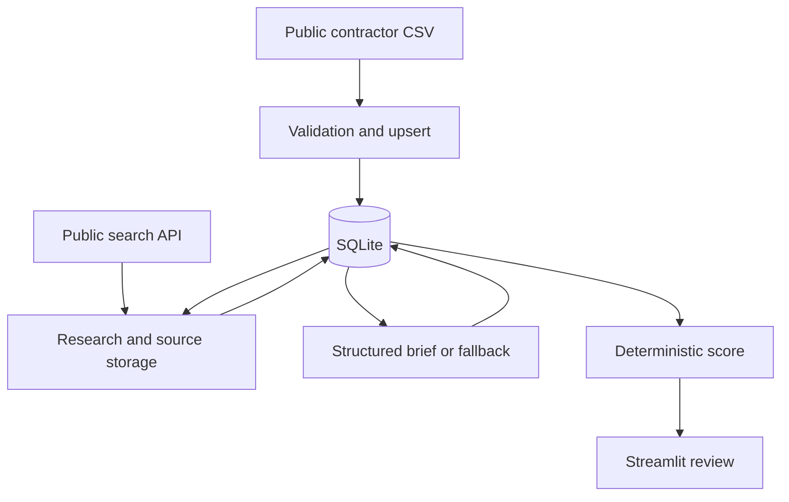

# Technical walkthrough

## Components and data flow

`src/ingest.py` normalizes CSV fields and upserts companies. `src/research.py` obtains public search results and classifies simple signals. `src/pipeline.py` coordinates caching, source persistence, insight generation, and per-company error recording. `src/intelligence.py` requests a Pydantic-shaped brief and filters cited URLs against stored evidence. `src/scoring.py` computes the score independently of the model response. `src/models.py` defines the relational entities and `app.py` displays the review workflow.

## Reliability choices

- CSV records are matched by GAF URL where present, with normalized company name plus postal code as the secondary lookup. Source quality still matters; duplicate identities are possible.
- Fresh evidence can be reused under a configured research TTL. An evidence hash avoids regenerating an insight when stored inputs did not change.
- The batch records failed companies and continues to the next. It is a synchronous prototype; there is no queue or production-grade retry monitor.
- An absent API key can trigger a low-confidence deterministic brief. The fallback is labelled as such in stored `model_name` and should not be presented as AI research.
- `sanitize_insight` checks URLs against retrieved URLs. It does not independently verify that a snippet supports every statement, so reviewers must open sources.

## Score components

| Component | Maximum |
| --- | ---: |
| Certification or award | 25 |
| Territory proximity | 15 |
| Public rating and reviews | 10 |
| Profile completeness | 10 |
| Recent activity signals | 15 |
| Decision-maker confidence | 15 |
| Product-fit confidence | 10 |
| **Total** | **100** |

The score is a heuristic for prioritization, not a calibrated probability of conversion. Missing distance scores zero, and the original captured seed has missing exact distances. See the implementation in `src/scoring.py` for thresholds.

## Limits and production direction

This prototype uses local SQLite, a synchronous job, manual seed review, and an interactive Streamlit UI. A production system would need authorized data acquisition, migrations, background jobs, identity and tenant controls, observability, cost limits, evaluation against labeled records, and periodic data-quality review. These are proposed next steps, not delivered features.
